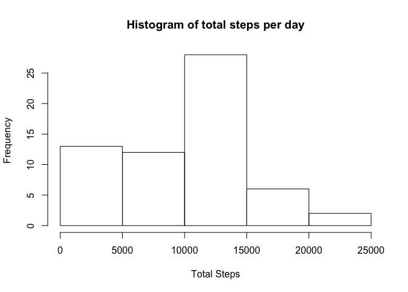
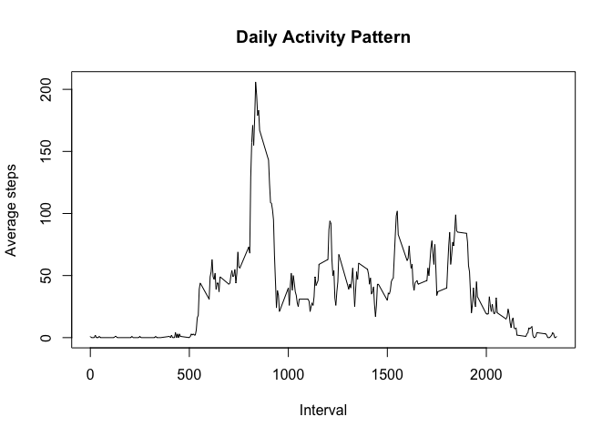
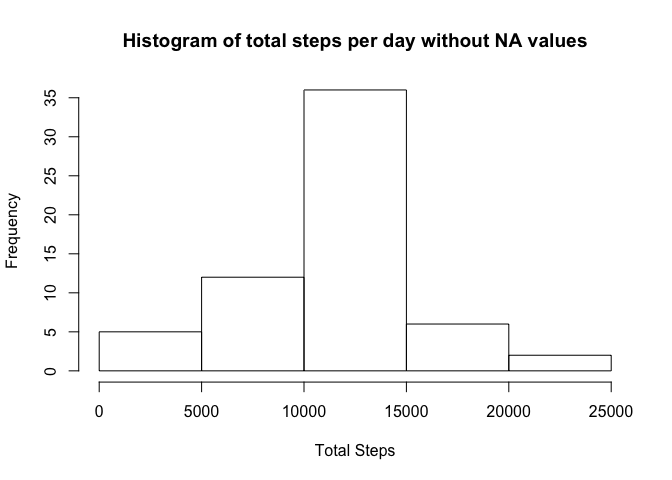

# Reproducible Research: Peer Assessment 1


## Loading and preprocessing the data

```r
# load the required data table library
library (data.table)
# unzip the data file and read the data
unzipData <- unz('activity.zip', 'activity.csv')
activityData <- read.table(unzipData, header = TRUE, sep = ',')
# convert the data into data table
activityData <- data.table(activityData)
# process the data to create date frame with the total steps group by date
dataSummary <- as.data.frame(activityData[, j=list(total = sum(steps, na.rm = TRUE)),by = date])
```


## What is mean total number of steps taken per day?

```r
#calculate the mean and median of the total steps per day
meanSteps <- as.integer(mean(dataSummary$total))
medianSteps <- median(dataSummary$total)
# histogram of total steps per day
hist(dataSummary$total, xlab='Total Steps', ylab='Frequency', main='Histogram of total steps per day')
```

 

- **Mean total number of steps taken per day (rounded to integer) = 9354**
- **Median total number of steps taken per day = 10395**

## What is the average daily activity pattern?

```r
# process the original data to create date frame with the total steps group by interval and the mean
dataSummaryDailyPattern <- as.data.frame(activityData[, j=list(total = sum(steps, na.rm = TRUE), mean = as.integer(mean(steps, na.rm = TRUE))),by = interval])

# Calculate the interval which has the maximum number of steps
maxMean <-(max(dataSummaryDailyPattern$mean, na.rm=TRUE))
maxInterval <-with(dataSummaryDailyPattern, interval[mean == maxMean])
maxInterval <- sprintf("%04d", maxInterval)
maxInterval <- format(strptime(maxInterval, format="%H%M"), format = "%H:%M")

# plot the time series for the interval and mean
plot(dataSummaryDailyPattern$interval, dataSummaryDailyPattern$mean, type='l', xlab = 'Interval', ylab = 'Average steps', main = 'Daily Activity Pattern')
```

 

- **Interval which has the maximum number of steps = 08:35**

## Imputing missing values

```r
# Calculate the total number of NA values in the original data table
totalNA <- sum(is.na(activityData$steps))
# Copy the original dataset
activityDataWithoutNA <- activityData
# Iterate through all the intervals and replace NA values
for (i in 1:nrow(dataSummaryDailyPattern)) {
    activityDataWithoutNA$steps[is.na(activityDataWithoutNA$steps) & activityDataWithoutNA$interval==dataSummaryDailyPattern[i,]$interval] <- dataSummaryDailyPattern[i,]$mean
}
# Create a data frame for the new data set
dataSummaryWithoutNA <- as.data.frame(activityDataWithoutNA[, j=list(total = sum(steps, na.rm = TRUE)),by = date])
#calculate the mean and median of the total steps per day
meanStepsWithoutNA <- as.integer(mean(dataSummaryWithoutNA$total))
medianStepsWithoutNA <- median(dataSummaryWithoutNA$total)
```

- **Strategy for filling the missing values**
    - Replace the missing values with the mean value for that interval across all days
    - Iterate through each interval and replace all the NA values for that interval in the main data set
    - Calculate the mean and median again
- **Total number of missing values in the data set = 2304**
- **Mean total number of steps taken per day, after replacing NA values (rounded to integer) = 10749**
- **Median total number of steps taken per day, after replacing NA values = 10641**
- **Impact of imputting missing data:**
    - Mean increased from 9354 to 10749
    - Median increased from 10395 to 10641


```r
# histogram of total steps per day
hist(dataSummaryWithoutNA$total, xlab='Total Steps', ylab='Frequency', main='Histogram of total steps per day without NA values')
```

 

## Are there differences in activity patterns between weekdays and weekends?

```r
activityDataWithoutNA$Weekday <- as.factor(ifelse(weekdays(as.Date(activityDataWithoutNA$date),abbreviate = FALSE) %in% c("Saturday","Sunday"), "Weekend", "Weekday")) 
```
